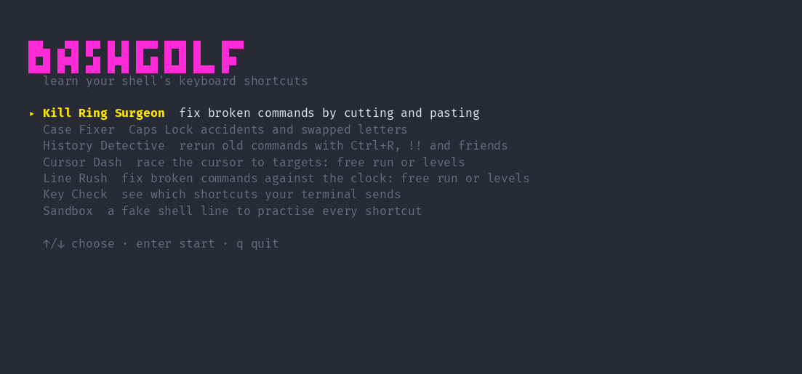

# bashgolf

Keystroke golf for your shell: fix broken commands in as few keys as you can,
and learn the line-editing shortcuts that make it possible.

Most of us edit commands by holding down the arrow keys and Backspace. Bash
(and zsh, and anything else built on readline) has had much faster ways to do
it for decades: jump by words, cut and paste with the kill ring, fix case,
swap letters, and dig old commands out of history. bashgolf teaches them as
short puzzles, each with a par.



## Install

You need Go 1.24 or newer.

```sh
go install github.com/iskaa02/bashgolf@latest
bashgolf
```

Or build it from a clone:

```sh
git clone https://github.com/iskaa02/bashgolf
cd bashgolf
go build -o bashgolf .
./bashgolf
```

## Game modes

| Mode | What you do |
| --- | --- |
| **Kill Ring Surgeon** | 14 levels on fixing broken commands by cutting and pasting: `Ctrl+A`, `Ctrl+E`, `Alt+F`, `Alt+B`, `Ctrl+K`, `Ctrl+U`, `Ctrl+W`, `Alt+D`, `Ctrl+Y`, `Alt+Y` |
| **Case Fixer** | 11 levels on Caps Lock accidents and fat-finger typos: `Alt+U`, `Alt+L`, `Alt+C`, `Ctrl+T`, `Alt+T` |
| **History Detective** | 11 levels on rerunning old commands without retyping them: `Ctrl+P`, `Ctrl+R`, `Alt+.`, `!!`, `!$`, `!string`, `!n`, `^old^new` |
| **Cursor Dash** | Get the cursor to the target in as few keys as you can, against the clock. Free run or levels |
| **Line Rush** | Fix randomly broken commands against the clock. Free run or levels |
| **Key Check** | Shows which shortcuts your terminal actually sends, useful when `Alt` is eaten by your terminal or OS |
| **Sandbox** | A fake shell line for practising every shortcut freely |

Every puzzle has a **par**: the fewest keys that solve it, worked out by a
solver. Matching par earns three stars. When you finish a level you can press
`g` to watch the par route replayed. Progress and high scores last for the
session only; nothing is saved to disk yet.

You can jump straight to a mode from the command line:

```sh
bashgolf killring   # or casefix, history, dash, rush, keycheck, sandbox
```

## Alt key not working?

Many terminals send `Alt` as Escape only when configured to. If `Alt+F` does
nothing, open **Key Check** to see what arrives, then enable your terminal's
"use Option as Meta" setting (macOS Terminal and iTerm2) or the equivalent.

## How accurate is it?

The line editor in `internal/readline` simulates bash's behaviour rather than
calling it, so the game runs anywhere. Its test cases (cursor movement, kill
ring, yank-pop, undo, case changes, transposes, incremental search and history
expansion) were checked against real bash 5.3 with the oracle scripts in
`tools/`:

```sh
go test ./...
# replay the test cases in a real bash and report mismatches
python3 tools/readline_oracle.py internal/readline/testdata/cases.json
```

## Project layout

```
main.go              entry point and command-line mode names
internal/readline    the simulated bash line editor
internal/game        level packs, par solver, scoring, Cursor Dash and Line Rush
internal/game/packs  level data as JSON
internal/ui          Bubble Tea screens
tools/               bash oracle scripts and the demo recorder
```

Built with [Bubble Tea](https://github.com/charmbracelet/bubbletea) and
[Lip Gloss](https://github.com/charmbracelet/lipgloss).

## License

[MIT](LICENSE)
